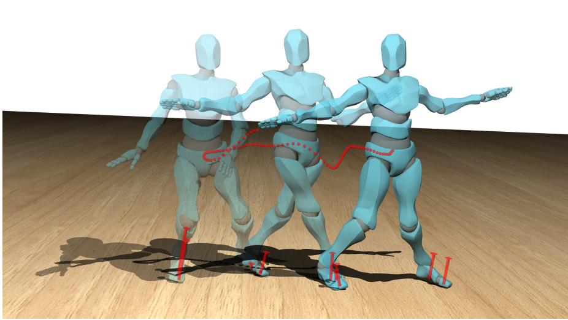

# Contact and Human Dynamics from Monocular Video
This is the official implementation for the ECCV 2020 spotlight paper by Davis Rempe, Leonidas J. Guibas, Aaron Hertzmann, Bryan Russell, Ruben Villegas, and Jimei Yang. For more information, see the [project webpage](https://geometry.stanford.edu/projects/human-dynamics-eccv-2020/).



## Environment Setup
> Note: the code in this repo has only been tested on Ubuntu 16.04.

First create and activate a virtual environment to install dependencies for the code in this repo. For example with conda:
* `conda create -n contact_dynamics_env python=3.6`
* `conda activate contact_dynamics_env`
* `pip install -r requirements.txt`

Note the package versions in the requirements file are the exact ones tested on, but may need to be modified for your system. The code also uses `ffmpeg`.

This codebase requires the installation of a number of external dependencies that have their own installation instructions/environments, e.g., you will likely want to create a different environment just to run Monocular Total Capture below. The following external dependencies are only necessary to run the full pipeline (both contact detection and physical optimization). If you're only interested in detecting foot contacts, it is only necessary to install [OpenPose](https://github.com/CMU-Perceptual-Computing-Lab/openpose).

To get started, from the root of this repo `mkdir external`.

#### Monocular Total Capture (MTC)
The full pipeline runs on the output from Monocular Total Capture (MTC). To run MTC, you must clone [this fork](https://github.com/davrempe/MonocularTotalCapture) which contains a number of important modifications:
* `cd external`
* `git clone https://github.com/davrempe/MonocularTotalCapture.git`
* Follow installation instructions in that repo to set up the MTC environment.

#### TOWR
The physics-based optimization takes advantage of the TOWR library. Specifically, [this fork](https://github.com/davrempe/towr) must be used:
* `cd external`
* `git clone https://github.com/davrempe/towr.git`
* Follow the intallation instructions to build and install the library using cmake.

#### Building Physics-Based Optimization
>**Important Note**: if you did not use the HSL routines when building IPopt as suggested, in `towr_phys_optim/phys_optim.cpp` you will need to change the line `solver->SetOption("linear_solver", "MA57");` to `solver->SetOption("linear_solver", "mumps");` before building our physics-based optimization. This uses the slower `MUMPS` solver and should be avoided if possible.

After building and installing TOWR, we must build the physics-based optimization part of the pipeline. To do this from the repo root:
```
cd towr_phys_optim
mkdir build && cd build
cmake .. -DCMAKE_BUILD_TYPE=Release
make
```

## Downloads

### Synthetic Dataset
The synthetic dataset used to train our foot contact detection network contains motion sequences on various [Mixamo](https://www.mixamo.com/#/) characters. For each sequence, the dataset contains rendered videos from 2 different camera viewpoints, camera parameters, annotated foot contacts, detected 2D pose (with OpenPose), and the 3D motion as a `bvh` file. Note, this dataset is only needed if you want to retrain the contact detection network.

To download the dataset:
* `cd data`
* `bash download_full.sh` to download the full (52 GB) dataset or `bash download_sample.sh` for a sample version (715 MB) with limited motions from 2 characters.

### Pretrained Weights
To download pretrained weights for the foot contact detection network, run:
* `cd pretrained_weights`
* `bash download.sh`

## Running the Pipeline on Real Videos
Next we'll walk through running each part of the pipeline on a set of real-world videos. A small example dataset with 2 videos is provided in `data/example_data`. Data should always be structured as shown in `example_data` where each video is placed in its own directory **named the same as the video file** to be processed - inputs and outputs for parts of the pipeline will be saved in these directories. There is a [helper script](scripts/create_optim_data_structure.py) to create this structure from a directory of videos.

The first two steps in the pipeline are running MTC/OpenPose on the video to get 3D/2D pose inputs, followed by foot contact detection using the 2D poses.

#### Running MTC
The first step is to run MTC and OpenPose. This will create the necessary data (2D and 3D poses) to run both foot contact detection and physical optimization.

The [`scripts/run_totalcap.py`](scripts/run_totalcap.py) is used to run MTC. It is invoked on a directory containg any number of videos, each in their own directory, and will run MTC on all contained videos. The script runs MTC, post-processes the results to be used in the rest of the pipeline, and saves videos visualizing the final output. The script copies all the needed outputs (in particular `tracked_results.json` and the OpenPose detection `openpose_results` directly to the given data directory). To run MTC for the example data, first `cd scripts` then:
```
python run_totalcap.py --data ../data/example_data --out ../output/mtc_viz_out --totalcap ../external/MonocularTotalCapture
```

Alternatively, if you only want to do foot contact detection (and don't care about the physical optimization), you can instead run OpenPose by itself without MTC. There is a helper script to do this in `scripts`:
```
python run_openpose.py --data ../data/example_data --out ../data/example_data --openpose ../external/openpose --hands --face --save-video
```
This runs OpenPose and saves the outputs directly to the same data directory for later use in contact detection.

#### Foot Contact Detection
The next step is using the learned neural network to detect foot contacts from the 2D pose sequence.

To run this, first download the pretrained network weights as detailed above. Then to run on the example data `cd scripts` and then:
```
python run_detect_contacts.py --data ../data/example_data --weights ../pretrained_weights/contact_detection_weights.pth
```

This will detect and save foot contacts for each video in the data directory to a file called `foot_contacts.npy`. This is simply an _Fx4_ array where _F_ is the number of frames; for each frame there is a binary contact label for the left heel, left toe, right heel, and right toe, in that order.

You may also optionally add the `--viz` flag to additionally save a video with overlaid detections (currently requires a lot of memory for videos more than a few seconds long).

#### Trajectory Optimization
Finally, we are able to run the kinematic optimization, retargeting, and physics-based optimization steps.

There is a single script to run all these - simply make sure you are in the `scripts` directory, then run:
```
python run_phys_mocap.py --data ../data/example_data --character ybot
```
This command will do the optimization directly on the [YBot Mixamo character](https://www.mixamo.com/#/?page=1&query=ybot&type=Character) ([ty](https://www.mixamo.com/#/?page=1&query=ty&type=Character) and [skeletonzombie](https://www.mixamo.com/#/?page=1&query=skeletonzombie&type=Character) are also availble). To perform the optimization on the skeleton estimated from video (i.e., to not use the retargeting step), give the argument `--character combined`.

Each of the steps in this pipeline can be run individually if desired, see how to do this in `run_phys_mocap.py`.

#### Visualize Results with Blender
We can visualize results on a character using Blender. Before doing this, ensure [Blender v2.79b](https://www.blender.org/download/releases/2-79/) is installed.

You will first need to download the Blender scene we use for rendering. From the repo root `cd data` then `bash download_viz.sh` will place `viz_scene.blend` in the `data` directory. Additionally, you need to download the character T-pose FBX file from the Mixamo website; in this example we are using the [YBot character](https://www.mixamo.com/#/?page=1&query=ybot&type=Character).

To visualize the result for a sequence, make sure you are in the `src` directory and use something like:
```
blender -b -P viz/viz_blender.py -- --results ../data/example_data/dance1 --fbx ../data/fbx/ybot.fbx --scene ../data/viz_scene.blend --character ybot --out ../output/rendered_res --fps 24 --draw-com --draw-forces
```

Note that there are many options to customize this rendering - please see the script for all these. Also the side view is set up heuristically, you may need to manually tune `setup_camera` depending on your video.

## Training and Testing Contact Detection Network on Synthetic Data
To re-train the contact detection network on the synthetic dataset and run inference on the test set use the following:
```
>> cd src
# Train the contact detection network
>> python contact_learning/train.py --data ../data/synthetic_dataset --out ../output/contact_learning_results
# Run detection on the test set
>> python contact_learning/test.py --data ../data/synthetic_dataset --out ../output/contact_learning_results --weights-path ../output/contact_learning_results/op_only_weights_BEST.pth --full-video
```

## Citation
If you found this code or paper useful, please consider citing:
```
@inproceedings{RempeContactDynamics2020,
    author={Rempe, Davis and Guibas, Leonidas J. and Hertzmann, Aaron and Russell, Bryan and Villegas, Ruben and Yang, Jimei},
    title={Contact and Human Dynamics from Monocular Video},
    booktitle={Proceedings of the European Conference on Computer Vision (ECCV)},
    year={2020}
}
```

## Questions?
If you run into any problems or have questions, please create an issue or contact Davis (`drempe@stanford.edu`).
